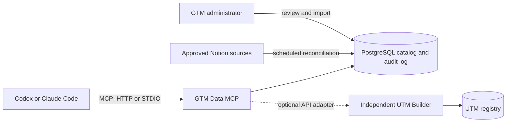

# GTM Data MCP

GTM Data MCP is Runpod's governed context layer for go-to-market operations. It gives compatible AI clients one place to find owners, teams, agencies, vendors, platform accounts, integrations, measurement assets, data definitions, runbooks, lineage, and safe bulk-change templates.

The server is deliberately independent from the Runpod UTM Builder. Either product can operate alone. When `UTM_BUILDER_URL` and `UTM_BUILDER_TOKEN` are configured, the MCP adds an optional UTM module that calls the builder's governed `/api/v1` interface for reference data, search, preview, and approved issuance.

## What V1 includes

- A searchable GTM catalog with typed records and relationships.
- Ownership, personnel, agency, vendor, account, measurement, and lineage lookups.
- Business-term and technical-field data dictionaries.
- Readiness checks that surface unverified, stale, conflicted, or pending information.
- Governed bulk-change templates with CSV generation and offline validation.
- A scheduled Notion reconciliation connector that proposes changes for review.
- PostgreSQL persistence, version checks, source evidence, locks, and an audit log.
- Local STDIO and remote Streamable HTTP MCP transports.
- A Slackbot MCP Client endpoint with request verification, org/workspace allowlisting, per-user identity, restricted-record controls, and invocation auditing.
- An optional, separately authenticated UTM Builder adapter.

V1 does **not** store credentials inside catalog records, write directly to advertising platforms, silently copy every Notion edit into the catalog, or make the UTM Builder depend on this server.

## Architecture



The failure boundary is intentional: catalog queries continue if the UTM Builder is unavailable; the UTM Builder and already-issued URLs continue if the MCP is unavailable.

## Tool inventory

| Area | Tools |
| --- | --- |
| Discovery | `gtm_module_status`, `gtm_search_catalog`, `gtm_get_record` |
| Ownership | `gtm_resolve_ownership`, `gtm_get_personnel_map`, `gtm_get_account_context` |
| Measurement | `gtm_get_measurement_inventory`, `gtm_trace_lineage`, `gtm_get_data_definition` |
| Operations | `gtm_find_runbooks`, `gtm_check_readiness`, `gtm_list_source_updates` |
| Bulk work | `gtm_list_bulk_templates`, `gtm_generate_bulk_template`, `gtm_validate_bulk_change` |
| Optional UTM | `utm_list_reference_data`, `utm_search_links`, `utm_preview_link`, `utm_issue_link`, `utm_issue_batch` |

All catalog and template tools are read-only. UTM issuance tools are only registered when the UTM API is configured, require an explicit `confirmed=true`, and use the independent builder's validation and registry.

## Quick start

Requirements: Node.js 20 or newer.

```bash
npm install
cp .env.example .env
npm run typecheck
npm test
npm run build
```

The bundled `data/catalog.json` supports a database-free local evaluation:

```bash
GTM_CATALOG_PATH=./data/catalog.json npm run dev
```

For local HTTP testing:

```bash
GTM_MCP_BEARER_TOKEN="replace-with-a-secret" npm run dev:http
```

The endpoints are `http://localhost:8787/mcp` and `http://localhost:8787/health`.

## Slack access

The production deployment exposes two independent MCP entry points:

- `/api/mcp` uses a bearer token for Codex, Claude Code, and other approved MCP clients.
- `/api/slack/mcp` accepts only Slack-signed Streamable HTTP requests and reads the verified caller from `_meta.slack`.

Connect the Slack endpoint to the shared **Runpod GTM Ops** Slack app using Slack identity auth. Users can then ask Slackbot questions such as “Who owns Google Ads and what is the escalation runbook?” without configuring an MCP client locally. Tool calls are attributed to the Slack enterprise/workspace/user identity and recorded in `gtm_audit_events`; tool arguments are deliberately excluded from the invocation audit payload.

The canonical Slack app manifest and deterministic `/utm` workflow live in the companion [UTM Builder repository](https://github.com/kenlim-mops/utm_builder_v2). See [Slack setup and operations](docs/SLACK.md).

## Codex and Claude Code compatibility

Yes. The server uses the open Model Context Protocol rather than a client-specific API. Both Codex and Claude Code support local STDIO and remote HTTP MCP servers; only their client configuration differs. The shared deployment recommendation is remote Streamable HTTP with HTTPS and authentication. See the [OpenAI MCP documentation](https://learn.chatgpt.com/docs/extend/mcp?surface=cli) and [Claude Code MCP documentation](https://code.claude.com/docs/en/mcp).

Codex remote configuration in `~/.codex/config.toml`:

```toml
[mcp_servers.gtm_data]
url = "https://gtm-data-mcp.example.com/api/mcp"
bearer_token_env_var = "GTM_DATA_MCP_TOKEN"
```

Claude Code remote configuration:

```bash
claude mcp add --transport http gtm-data \
  https://gtm-data-mcp.example.com/api/mcp \
  --header "Authorization: Bearer ${GTM_DATA_MCP_TOKEN}"
```

Local STDIO is also available after `npm run build`:

```bash
claude mcp add --transport stdio gtm-data -- node /absolute/path/to/gtm_data_mcp/dist/src/index.js
```

For Codex, use `command = "node"` and `args = ["/absolute/path/to/gtm_data_mcp/dist/src/index.js"]` under `[mcp_servers.gtm_data]`.

## Data model

Supported record types are `person`, `team`, `agency`, `vendor`, `system`, `account`, `integration`, `data_term`, `data_field`, `measurement_asset`, `runbook`, `policy`, and `report`. Relationships express responsibilities and lineage without embedding the same fact in many records.

Every record carries lifecycle, sensitivity, verification state, source evidence, version, and update timestamps. `restricted` records are excluded by default. Secrets belong in the deployment secret store and are referenced by environment-variable name, never copied into the catalog.

## Administration and deployment

- [User and administration guide](docs/USER_GUIDE.md)
- [Deployment guide](docs/DEPLOYMENT.md)
- [Architecture decisions](DECISIONS.md)

## Security posture

- Standard remote requests require a fixed bearer token in V1; Slack requests use Slack signatures and Slack identity instead.
- Slack calls enforce timestamp-based replay protection and can be limited to approved enterprise/workspace IDs. Restricted records require a separate per-user allowlist.
- Source updates are review-first. Auto-apply is possible only for existing records and an explicit per-connector top-level field allowlist.
- Proposal approval uses optimistic version checks so a stale proposal cannot overwrite a newer catalog update.
- UTM tokens and Notion tokens remain server-side.
- Bulk tools generate and validate files but do not upload them to third-party platforms.

## Repository status

This is a V1 foundation. The starter catalog contains verified UTM identifier definitions and several draft platform templates. Draft templates must be certified against a current export and current platform documentation before production use.
